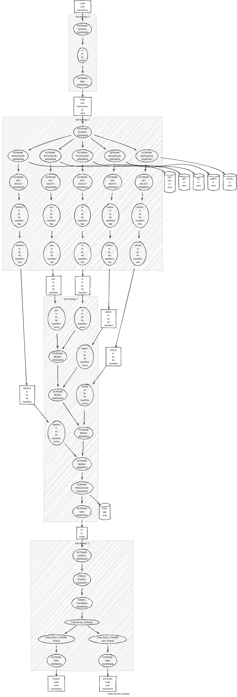

## References
- https://developer.confluent.io/courses/kafka-streams/hands-on-processor-api/
- https://kafka.apache.org/21/documentation/streams/developer-guide/testing.html
- https://developer.confluent.io/courses/kafka-streams/hands-on-testing/

## Notes

- MainApp won't be implemented use [MainAppTestFinal.java](./src/test/java/szp/rafael/cct/MainAppTestFinal.java) instead
## Final Version

## Appendix
- Análise feita pelo gemini (ficou até boa): [Análise da topologia](AnaliseGemini.md)
- Topology visualizer: https://zz85.github.io/kafka-streams-viz/